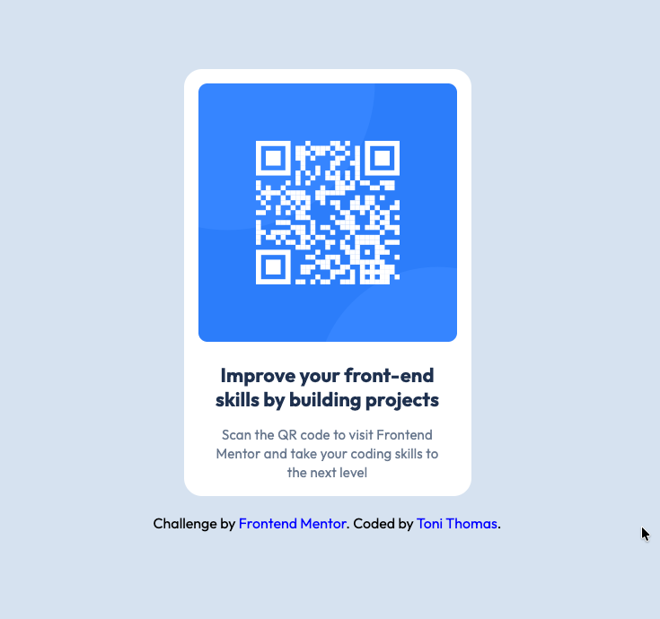

# Frontend Mentor - QR code component solution

This project was originally built as part of [QR code component challenge on Frontend Mentor](https://www.frontendmentor.io/challenges/qr-code-component-iux_sIO_H). For this lab, I refactored the original solution by replacing custom CSS with Tailwind CSS utility classes. 

You can view the original version here: [Original Solution Live Link](https://ps-mod3-figma-qrcode.vercel.app/)

## Table of contents

- [Screenshot](#screenshot)
- [Original Live link](#original-solution-live-link)
- [What I learned](#what-i-learned)
- [Continued development](#continued-development)
- [Author](#author)
- [Reflection](#reflection-questions)

### Screenshot

### Original Solution Live Link

[QR Code Component – Original Version](https://ps-mod3-figma-qrcode.vercel.app/)

### What I learned

This project helped me get more comfortable converting CSS rules into Tailwind utility classes. I also learned how Tailwind handles spacing, sizing, colors, and pseudo-classes differently than traditional CSS.

### Continued development

I’d like to revisit this project again in the future and refactor it using Bootstrap instead of Tailwind to compare the two approaches.

### Author

- Website - [Toni Thomas](https://toni-thomas.vercel.app/)
- Frontend Mentor - [DiyBookOfLife](https://www.frontendmentor.io/profile/DiyBookOfLife)
- LinkedIn - [Toni Thomas](https://www.linkedin.com/in/tonithomas2025/)

## Reflection questions

**1. What challenges did you face when refactoring your code to use Tailwind?**

- The biggest challenge was translating pixel-based CSS  into Tailwind’s utility classes. It also took some time to get used to applying things like `focus-visible` and handling colors without relying on a traditional stylesheet.

**2. How did using Tailwind utility classes and components simplify your styling process?**

- Tailwind made it easier to see exactly how each element was styled without jumping back and forth between HTML and CSS files. Once I understood the spacing scale, layout changes became much faster.

**3. In what scenarios might you choose not to use Tailwind and write custom CSS instead?**

- I would probably avoid Tailwind for very small projects or designs that need highly custom styling, where writing plain CSS would be simpler and more flexible.
